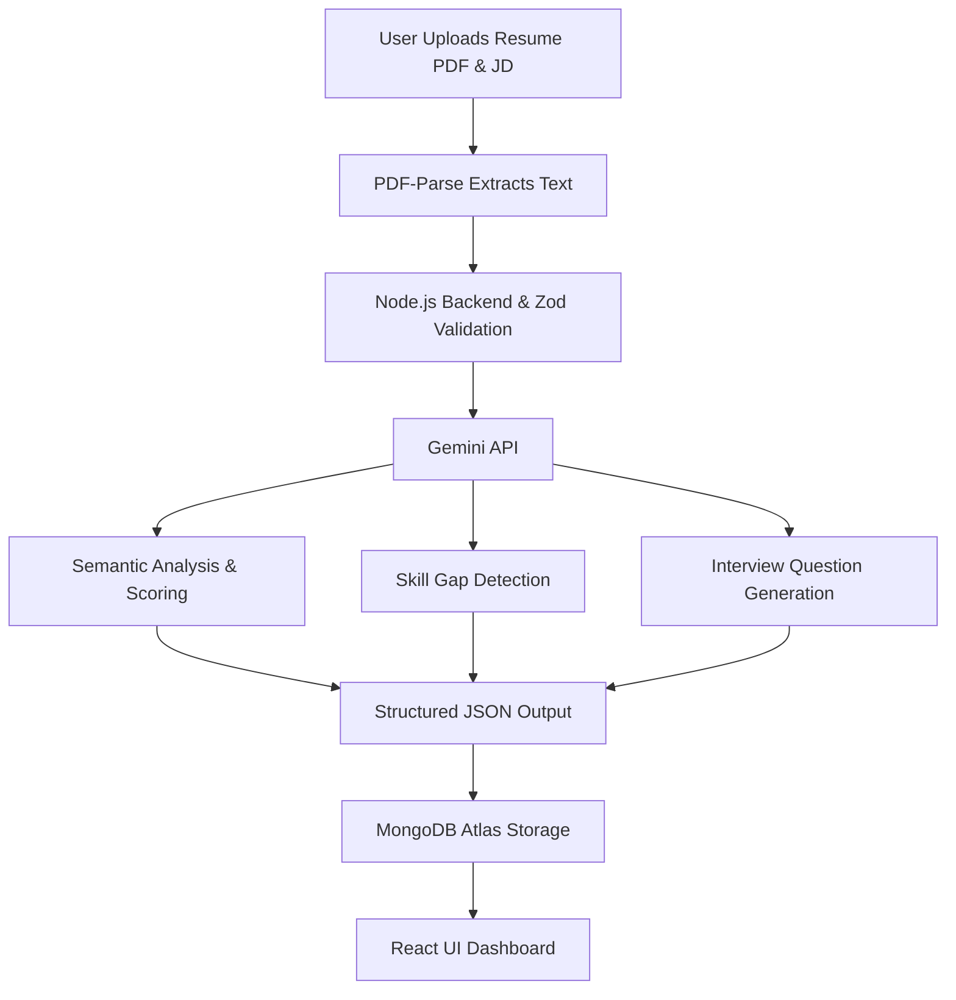

# 🚀 CareerLens AI

> An intelligent, AI-driven platform designed to optimize resumes, generate personalized interview preparation plans, and provide deep ATS-compatibility analysis.

CareerLens AI leverages Google's **Gemini API** alongside a robust **Node.js/React** stack to parse resume data, compare it semantically against job descriptions, and deliver actionable career insights.

---

## ✨ Key Features

- **📄 Automated Resume Parsing:** Extracts and analyzes unstructured data from uploaded PDFs.
- **🎯 ATS Match Scoring:** Evaluates resume-to-JD compatibility using semantic matching.
- **🧠 Skill Gap Analysis:** Highlights critical missing keywords and required competencies.
- **💡 Dynamic Question Generation:** Auto-generates targeted technical and behavioral interview questions based on the candidate's specific profile and the role's difficulty.
- **📈 Learning Roadmaps:** Creates day-by-day personalized preparation strategies.
- **🔄 ATS-Friendly PDF Export:** Re-generates and exports optimized resumes dynamically via Puppeteer.
- **🔐 Enterprise-Grade Security:** Secures endpoints and user sessions with JWT, HTTP-only cookies, bcrypt, and token blacklisting.

---

## 🤖 System Architecture & AI Workflow



---

## 🛠 Tech Stack

### Frontend
- **Framework:** React.js, Vite
- **Styling:** SCSS, Custom Design System
- **Routing:** React Router DOM

### Backend
- **Runtime:** Node.js
- **Framework:** Express.js
- **Database:** MongoDB Atlas
- **AI Integration:** Google Gemini API (`@google/genai`)
- **Document Processing:** PDF-Parse, Puppeteer
- **Storage:** Cloudinary
- **Security & Validation:** JWT, bcrypt, Zod, Nodemailer (OTP)

---

## 🚀 Getting Started

### Prerequisites
Before you begin, ensure you have the following installed:
- [Node.js](https://nodejs.org/) (v16 or higher)
- [MongoDB](https://www.mongodb.com/) (Local or Atlas cluster)
- API Keys for Google Gemini and Cloudinary

### 1. Clone the Repository
```bash
git clone https://github.com/ravindraChoudhary056/CareerLens-AI-ravi.git
cd CareerLens-AI
```

### 2. Backend Setup
Navigate to the backend directory and install dependencies:
```bash
cd Backend
npm install
```

Create a `.env` file in the `Backend` directory and configure the following variables:
```env
# Server Configuration
PORT=5000

# Database
MONGO_URI=your_mongodb_atlas_connection_string

# Authentication
JWT_SECRET=your_super_secret_jwt_key

# External APIs
GEMINI_API_KEY=your_gemini_api_key

# Cloudinary Storage
CLOUDINARY_CLOUD_NAME=your_cloud_name
CLOUDINARY_API_KEY=your_cloudinary_api_key
CLOUDINARY_API_SECRET=your_cloudinary_api_secret

# Email Service (Nodemailer OTP)
EMAIL_USER=your_email@gmail.com
EMAIL_PASS=your_16_digit_app_password
```

Start the backend development server:
```bash
npm run dev
```

### 3. Frontend Setup
Open a new terminal, navigate to the frontend directory, and install dependencies:
```bash
cd Frontend
npm install
```

Start the frontend development server:
```bash
npm run dev
```

The application will be running at `http://localhost:5173` (or the port specified by Vite).

---

## 🔒 Security Implementations

Security is prioritized throughout the application lifecycle:
- **Authentication:** Stateless authentication using JWTs delivered via secure, HTTP-only cookies.
- **Authorization:** Middleware-protected private routes.
- **Data Protection:** Passwords hashed with bcrypt; one-time passwords (OTP) for email verification.
- **Session Management:** Token blacklisting implemented for secure logout operations.
- **Data Validation:** Strict runtime type-checking and schema validation for all API inputs using Zod.

---

## 👨‍💻 Author

**Ravindra Choudhary**  
*Full Stack Developer | AI Integration 

⭐️ *If you found this project helpful, please consider giving it a star!*
